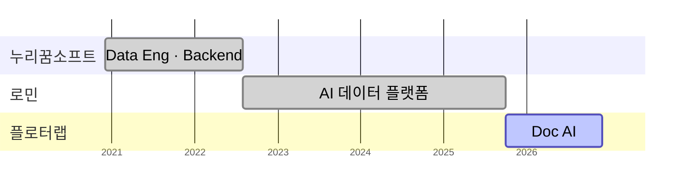
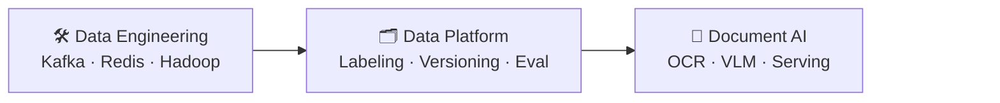
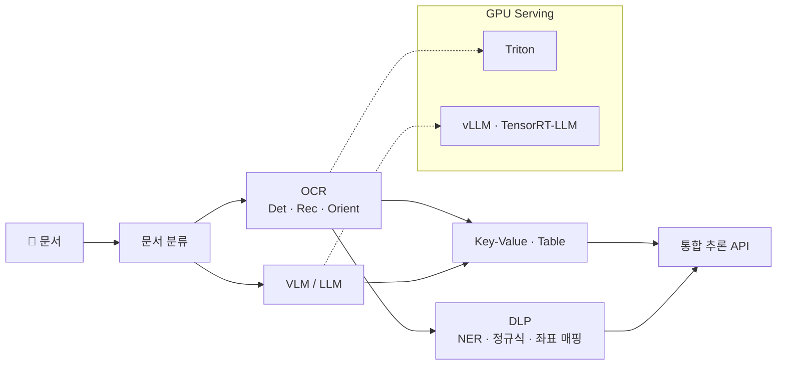
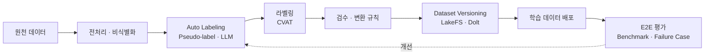
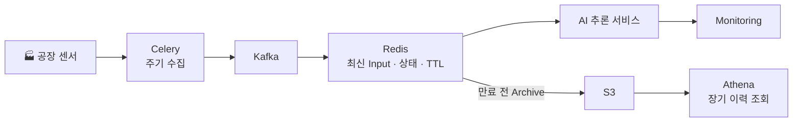

## 안녕하세요, 김태석입니다 👋

**데이터 엔지니어로 시작해, 지금은 Document AI(OCR · VLM) 제품을 End-to-End로 만듭니다.**
데이터 파이프라인 → AI 학습 데이터 플랫폼 → 모델 개발 · GPU Serving · On-premise 배포까지,
AI가 실제 기업 환경에서 **안정적으로 운영되는 시스템**을 설계하는 것을 좋아합니다.

---

## 📈 Impact

| ⚡ OCR 추론 속도 | 🏷️ 라벨링 생산성 | 🚚 데이터 배포 시간 | 🤖 LLM Auto Labeling |
|:---:|:---:|:---:|:---:|
| **~0.1s / page** 초당 10~15페이지 | **약 2×** 데이터 플랫폼 도입 | **약 50% ↓** 검수·변환 규칙 시스템화 | **약 20% ↓** 예상 작업시간 대비 |

🏆 **과학기술정보통신부 장관 표창** (2025) · AI·데이터 분야 기술개발 및 산업 발전 기여

---

## 🧭 Career

---

## 🛠 Tech Stack

**AI · Serving**

**Backend**

**Data**

**Infra · Ops**

---

## 💼 Experience

### 🏢 플로터랩 · AI 솔루션개발팀 · 책임연구원 / 팀장
2025.10 ~ 현재

OCR · 문서 분류 · 정보 추출 · 개인정보 탐지(DLP)를 하나의 플랫폼에서 운영하는 **Document AI 제품**을 모델부터 배포까지 개발합니다.

- **Document AI 모델 · 파이프라인** — OCR Detection / Recognition / Orientation, 문서 분류, Key-Value Extraction, Table Parsing
- **VLM SFT** — Qianfan-OCR 기반 Table Parsing Fine-tuning, Benchmark · Failure Case 분석으로 반복 개선
- **개인정보 탐지(DLP)** — OCR · VLM · 정규식 · NER 결합, OCR 좌표 매핑 및 규칙 기반 Validation으로 오탐·미탐 감소
- **GPU Serving** — Triton(OCR/Vision) · vLLM / TensorRT-LLM(LLM·VLM) 기반 통합 추론 API, **페이지당 약 0.1초**
- **On-premise** — 폐쇄망용 Docker Offline 설치 표준화, GPU Driver / CUDA 호환성 검증, Prometheus · Grafana · Loki 모니터링
- 금융 · 보험 · 공공 분야 PoC 및 구축, 고객별 요구사항을 제품 공통 기능으로 일반화

🗺️ 아키텍처 보기

`PyTorch` `ONNX` `YOLO` `VLM` `SFT` `Triton` `vLLM` `TensorRT-LLM` `FastAPI` `Rust` `Next.js` `Docker` `Qdrant` `Loki`

### 🏢 로민 · 데이터팀 · 연구원 / 팀장
2022.08 ~ 2025.10 · 3년 3개월

Document AI 모델을 위한 **AI 학습 데이터 Lifecycle 전반**(수집 → 라벨링 → 검수 → 배포 → 평가)을 설계하고 플랫폼으로 자동화했습니다.

- **학습 데이터 구축** — 문서 도메인 분석 및 Label Schema 설계, 보험 청구서류 · 무역금융 · 신분증 · 처방전 · 계약서 · 특허 · 설계도면 Dataset
- **라벨링 인프라** — CVAT 기반 사내 라벨링 환경, 작업자별 생산량 · 품질 모니터링, Pseudo-label Auto Labeling
- **데이터 플랫폼** — CVAT · FiftyOne · LakeFS · Dolt 기반 Dataset Versioning 및 출처 · 버전 추적성 확보
- **모델 평가 체계** — 독립 Test Set, End-to-End 인식률 측정, Version별 Benchmark 표준화
- **LLM Auto Labeling** — LLM API 기반 Key-Value Pseudo-label 생성 파이프라인을 플랫폼에 내재화

> 📊 데이터 배포 시간 **약 50% 단축** · 라벨링 생산성 **약 2배** · LLM Auto Labeling **약 20% 단축**
> 🏅 데이터 플랫폼 개발 성과로 **사내 우수인력 선정**

🗺️ 아키텍처 보기

`Python` `Django` `Celery` `Airflow` `PostgreSQL` `MinIO` `CVAT` `FiftyOne` `LakeFS` `Dolt` `Grafana` `Prometheus`

### 🏢 누리꿈소프트 · OSS 아키텍처 · 연구원
2020.12 ~ 2022.08 · 1년 9개월

데이터 엔지니어링 · Backend · AI 운영시스템 구축을 담당했습니다.

#### 🏭 제조 AI 운영시스템 · 실시간 데이터 파이프라인
*고객사: 제조 대기업* · 🏆 **고객사 AI 적용 우수사례 선정**

- 공장별 센서 데이터를 수집해 AI 추론 · Monitoring으로 잇는 실시간 파이프라인 (Celery · Kafka · Redis)
- Redis TTL 정책과 만료 전 **S3 Archive** 구조, **AWS Athena** 장기 이력 조회 환경
- 타 사업부 확산에 따른 Scale-out — **Kafka Heartbeat 이슈**, **Redis Cluster** 전환, 외부 추론 장애 격리(Timeout), Memory Leak 해결

🗺️ 아키텍처 보기

#### 🧵 CRM Backend · 데이터 관리 시스템
*고객사: 중소기업* · 🏆 **중소기업 디지털 전환 우수사례 선정**

- 현장 업무 분석 기반 ERD · Backend 설계, FastAPI / SQLAlchemy REST API
- Elasticsearch · S3 기반 이미지 Metadata · 원본 관리, 카카오톡 챗봇 · 알림톡 연동 자동화

#### 🐘 폐쇄망 Hadoop 클러스터
- CentOS 6대 기반 CDH 클러스터 (ZooKeeper · HDFS · HBase · Hive · Impala · Kudu · NiFi), 폐쇄망 재현 가능한 설치 절차 정립

`Python` `FastAPI` `Celery` `Kafka` `Redis` `Hadoop` `PostgreSQL` `Elasticsearch` `AWS` `React`

---

## 🌐 Industries

      

---

## 🧩 Open Source · Research

- **[Poetry Core #672](https://github.com/python-poetry/poetry-core/pull/672)** — `package_dir` 관련 기능 구현 및 테스트 
- **[FiftyOne #3821](https://github.com/voxel51/fiftyone/pull/3821)** — Poetry 기반 Build 환경 개선 
- **Nature Communications 16, 8838 (2025)** · Co-author — *Interfacial chemistry-driven reaction dynamics and resultant microstructural evolution in lithium-based all-solid-state batteries* (ex-situ TXM 분석 프로그램 개발) 

---

## 📜 Awards · Certifications

- 🏆 과학기술정보통신부 장관 표창 (2025)
- 🏅 로민 사내 우수인력 선정
- 정보처리기사 · 빅데이터분석기사 · SQLD · ADsP · 리눅스마스터 2급 · 네트워크관리사 2급
